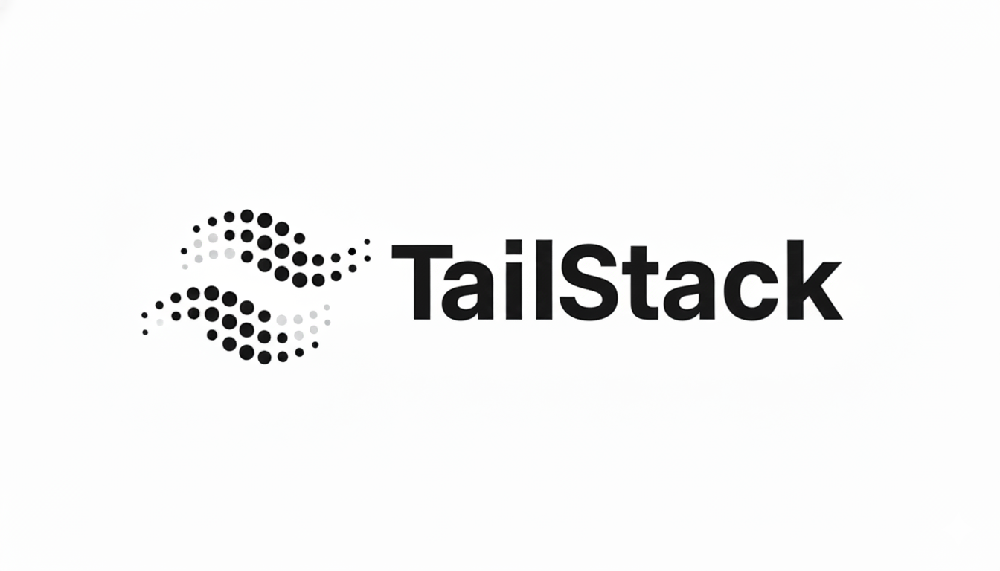

# TailStack



<div align="center">

**The Ultimate Production-Grade Monorepo Architecture Template for ERN Stack (Express, React, Node.js)**

[](LICENSE)
[](Docs/CONTRIBUTING.md)
[](https://www.typescriptlang.org/)
[](https://vitejs.dev/)
[](https://tailwindcss.com/)

[Report Bug](https://github.com/yourusername/tailstack/issues) · [Request Feature](https://github.com/yourusername/tailstack/issues)

</div>

---

## Introduction

**TailStack Core** is the flagship Monorepo **Project Architecture** and boilerplate within the TailStack collection, designed to serve as a robust starting point for your **ERN** (Express, React, Node.js) applications.

It implements the **TailStack Architecture**—a proven structure I personally use for full-stack development—providing a scalable, secure, and maintainable foundation. It includes industry-standard tooling, rigorous linting, and a beautiful UI system, all pre-configured so you can hit the ground running.

**Not a rigid framework**, TailStack is designed to be fully customizable. Whether you are building a startup MVP or a large-scale enterprise solution, it offers the perfect customizable launchpad to adapt to your specific needs.

## Features

### Frontend (Client)
Experience a modern, lightning-fast development environment:
- **Vite**: Next-generation frontend tooling.
- **React**: Built on the world's most popular UI library.
- **Tailwind CSS**: Utility-first CSS for rapid UI development.
- **Shadcn UI**: Reusable, accessible, and customizable components.
- **Lucide React**: Beautiful & consistent icons.
- **Sonner**: An opinionated toast component for React.
- **React Router**: Declarative routing for your application.
- **Weather App Demo**: Includes a fully functional multi-page weather application to showcase the architecture.

###  Backend (Server)
A robust and scalable server-side foundation:
- **Express**: Fast, unopinionated, minimalist web framework for Node.js.
- **TypeScript**: Type safety for reliable and maintainable code.
- **Node Cluster**: Utilizes multi-core systems for maximum performance.
- **Security**: Pre-configured **CORS** and security best practices.

###  Monorepo & DevOps Tools
TailStack allows you to focus on code, not configuration:
- **Commitlint**: Enforces Conventional Commits for clean history.
- **Husky**: Git hooks for pre-commit linting and security checks.
- **Automation Scripts**: Cross-platform utilities for high-velocity development (in `scripts/`).
- **Documentation**: Ready-to-use `CONTRIBUTING.md`, `CODE_OF_CONDUCT.md`, and `SECURITY.md`.
- **Configs**: Standardized `.npmrc`, `.nvmrc`, and `.node-version` for consistent environments.

### Agent Skills
TailStack comes supercharged with pre-configured **Agent Skills** to accelerate AI-driven development.

#### What are Agent Skills?
Skills are reusable capabilities for AI agents. They provide procedural knowledge that helps agents accomplish specific tasks more effectively. Think of them as plugins or extensions that enhance what your AI agents can do, enabling them to write, refactor, and optimize code with greater precision and domain-specific expertise.

#### Pre-configured Skills in TailStack
1. **Vercel React Best Practices**: A comprehensive performance optimization guide for React and Next.js applications, maintained by Vercel. It contains 57 rules across 8 categories, prioritized by impact to guide automated refactoring and code generation.
- **Official Docs**: [https://skills.sh/vercel-labs/agent-skills/vercel-react-best-practices](https://skills.sh/vercel-labs/agent-skills/vercel-react-best-practices)
  
2. **Node.js Backend Patterns**: This Skill is a Comprehensive guidance for building scalable, maintainable, and production-ready Node.js backend applications with modern frameworks, architectural patterns, and best practices.
- **Official Docs**: [https://skills.sh/wshobson/agents/nodejs-backend-patterns](https://skills.sh/wshobson/agents/nodejs-backend-patterns)

3. **Tailwind v4 + shadcn/ui Production Stack**: This skill enables AI agents to correctly generate, modify, and work with components from shadcn/ui and the new Tailwind CSS v4 engine. It understands the nuances of both technologies, ensuring idiomatic and production-quality results.

- **Official Docs**: [https://skills.sh/jezweb/claude-skills/tailwind-v4-shadcn](https://skills.sh/jezweb/claude-skills/tailwind-v4-shadcn)

### Default Supported Agents 
- Gemini
- Claude
- Codex
- Cursor 
- Opencode
- Trae

## Project Structure

A glimse into the **TailStack** organization:

```bash
core/
├── assets/                 # Static assets (images, logos)
├── Docs/                   # Application & Community documentation
│   ├── CODE_OF_CONDUCT.md
│   ├── CONTRIBUTING.md
│   └── SECURITY.md
├── scripts/                # Cross-platform automation scripts
│   ├── clean.ps1           # PowerShell: Lightning-fast node_modules purge
│   ├── clean.sh            # Shell: Lightning-fast node_modules purge
│   ├── install.ps1         # PowerShell: Parallel pnpm installer
│   └── install.sh          # Shell: Parallel pnpm installer
├── source/
│   ├── frontend/           # The Vite+React Client Application
│   │   ├── src/
│   │   │   ├── components/ # Shadcn UI & Custom Components
│   │   │   ├── pages/      # pages
│   │   │   └── ...
│   │   └── vite.config.ts
│   └── Server/             # The Express+TS Backend Application
│       ├── src/
│       │   ├── cluster/    # Node Cluster logic
│       │   ├── routes/     # API Routes
│       │   └── ...
│       └── tsconfig.json
├── .husky/                 # Git hooks configuration
```

## Getting Started

### 🚀 Development

To start both the client and server concurrently in development mode:

```bash
pnpm dev
```

- **Frontend**: Accessible at `http://localhost:5173`
- **Backend**: API server running on `http://localhost:5000`

### 🛠️ Automation Scripts

TailStack Core includes advanced, cross-platform automation scripts to manage your monorepo efficiently. Both PowerShell (`.ps1`) and Bash (`.sh`) versions are provided.

#### 1. Smart Clean (`clean.ps1` / `clean.sh`)
A high-velocity two-phase purge that removes all `node_modules` and `pnpm-lock.yaml` files.
- **Speed**: Uses parallel processing for faster deletion.
- **Reliability**: Forcefully kills locking processes (Node, VS Code) and uses a 3-retry verification loop for stubborn files.

#### 2. Smart Install (`install.ps1` / `install.sh`)
A parallel installer designed for stability on any hardware.
- **Parallelism**: Installs dependencies for all projects in the monorepo concurrently.
- **Load Monitoring**: An intelligent state machine monitors CPU and RAM, automatically suspending installation processes if system load exceeds 90% and resuming when it drops below 75%.
- **Anti-Crash**: Prevents system hangs during heavy dependency resolution.

## 🤝 Contributing

Contributions are what make the open source community such an amazing place to learn, inspire, and create. Any contributions you make are **greatly appreciated**.

---

<p align="center">
  Built with the <strong>TailStack Architecture</strong>.
</p>
